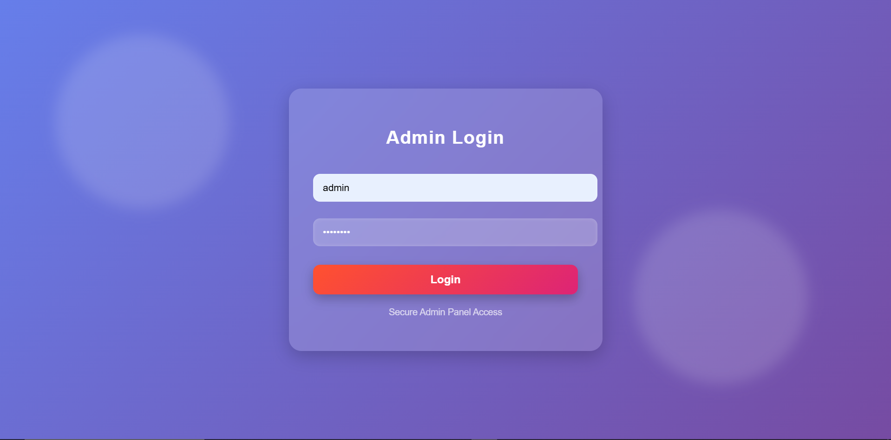
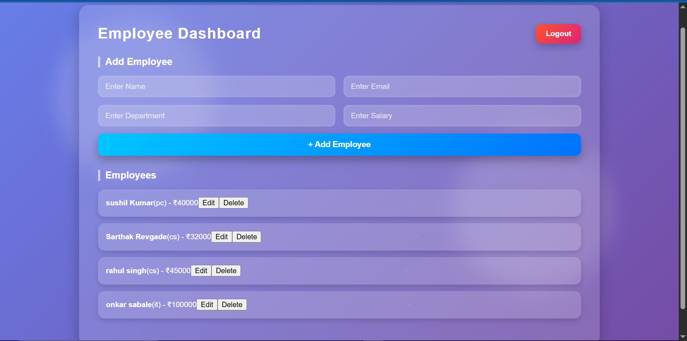

📌 Employee Management System (Node.js + Express + MongoDB + JWT + Frontend)

A secure full-stack Employee Management System built using:
Node.js & Express (Backend REST API)
MongoDB & Mongoose (Database)
JWT Authentication (Secure admin access)
HTML, CSS & JavaScript (Frontend UI)

This system allows an Admin to:
✔ Login securely
✔ Add new employees
✔ View all employees
✔ Update employee details
✔ Delete employees
✔ Access data only with valid JWT token

🚀 Features
Feature	Description
Admin Authentication	Login system using JWT
Protected Routes	Only logged-in admin can access employees
CRUD Operations	Create, Read, Update, Delete employees
MongoDB Database	Stores employees & admin securely
Frontend UI	Dashboard to manage employees
Form Validation	Prevents empty & invalid data
Secure Passwords	Password hashing using bcryptjs

🏗️ Project Structure
employee-management/
│
├── config/
│   └── database.js
│
├── middleware/
│   └── authMiddleware.js
│
├── models/
│   ├── Admin.js
│   └── Employee.js
│
├── routes/
│   ├── authRoutes.js
│   └── employeeRoutes.js
│
├── public/
│   ├── login.html
│   ├── dashboard.html
│   └── app.js
│
├── server.js
├── .env
└── package.json

⚙️ Installation & Setup
1️⃣ Clone the repository
git clone https://github.com/yourname/employee-management.git
cd employee-management
2️⃣ Install dependencies
npm install
3️⃣ Create .env file
MONGO_URI=mongodb://127.0.0.1:27017/employeeDB
JWT_SECRET=yourSecretKey
PORT=5000
4️⃣ Start the server
npm run dev
Frontend is present in public file.
5️⃣ Open frontend
http://localhost:5000/login.html

🔑 Authentication Flow (Important)
Step	What happens
Admin logs in	Server verifies credentials
JWT issued	Token returned to frontend
Token stored	Saved in localStorage
Token sent with API calls	Authorization header
Server verifies token	Middleware checks authenticity
🛡️ API Endpoints
🔐 Auth Routes
Method	Endpoint	Description
POST	/api/auth/register	Register admin
POST	/api/auth/login	Login admin & get token
👨‍💼 Employee Routes (Protected)
Method	Endpoint	Description
POST	/api/employees	Add employee
GET	/api/employees	Get all employees
PUT	/api/employees/:id	Update employee
DELETE	/api/employees/:id	Delete employee

🚨 All employee APIs require JWT token in headers:
Authorization: Bearer YOUR_TOKEN_HERE

🖥️ Frontend Screens
Login Page
Admin enters username & password
On success → redirected to dashboard
Dashboard
View employee list
Add / Update / Delete employees

🧠 What You Learned (Interview Points)
REST API development in Express
MongoDB schema modeling & CRUD
JWT authentication / middleware security
Frontend → Backend communication using fetch()
Environment variable security with .env
Proper folder structure like real companies
Error handling & validations

🚀 Future Enhancements (Optional Improvements)
Admin & Manager role system
Pagination & search employees
UI upgrade using Bootstrap / React
Deployment on Render / Railway + MongoDB Atlas
Toast messages, form validation, modals

🙌 Author
Sarthak Revgade
🎯 IT Student | 🎮 Future Gaming Industry Builder | 💻 Backend & Full-Stack Developer
Created with guidance and support from ChatGPT 🤝

Images
ADMIN PANEL

DASHBOARD PANEL

⭐ Show Support
⭐ If you like this project, give it a star on GitHub!
